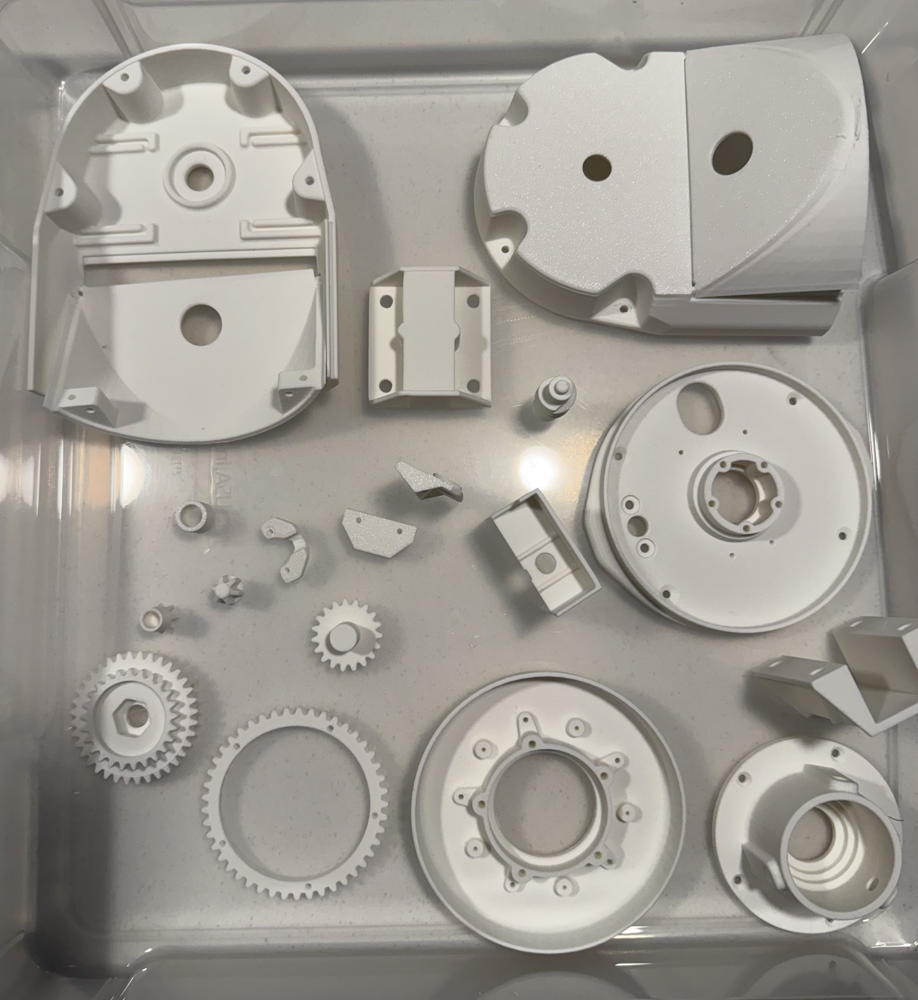

+++
title = "AMSAT Adventures (Part 1)"
date = "2025-08-29"
+++

Wouldn't it be awesome to pull telemetery and images from the downlink of a satellite orbitting the Earth?

<!--more-->

I thought so too! So I got started learning about [Yagi antennas](https://makezine.com/projects/homemade-yagi-antenna/) and UHF FM. And we're not going to be able to transmit, but with line of sight we should be able to point this at one and potentially get data.

I ended up getting an antenna that broke down from [ebay](https://www.ebay.com/itm/116579153781)

Because I don't want pointing the antenna to be a problem I have to deal with I'm going to use a tracking rig. Something I can just feed a azimuth and elevation to. This antenna is light, so we can get away with 3d printed parts assuming I can find anything

Enter [Satran!](https://satran.danaco.se/specifications/) -- a completed open source project doing everything we want.

Looks like a kit that they once sold, as of this writing they do not. And they do provide all the 3d model files, BOMs, PCBs, everything. Some other cool internet people put together [spreadsheets](https://docs.google.com/spreadsheets/d/1tgL_Klc7qYQEB_H5mjExTGCIgY_hv1UHhMzeUf3lJTk/edit?gid=0#gid) with vendors you can order all the parts from online.

Here is my progress w/ the 3d printed parts, basically the only thing I can do for right now. Next steps? I've ordered the PCBs, aluminum pieces, and electronic components.I should have everything in 2-3 weeks. 🤞🤞🤞🤞

# 3d Printing

The files print perfectly, matte white w/ a Bambulabs P1P.

[MK3 print files (.rar)](https://satran.danaco.se/Satran-MK3-printfiles.rar) from [https://satran.danaco.se/downloads/](https://satran.danaco.se/downloads/)

