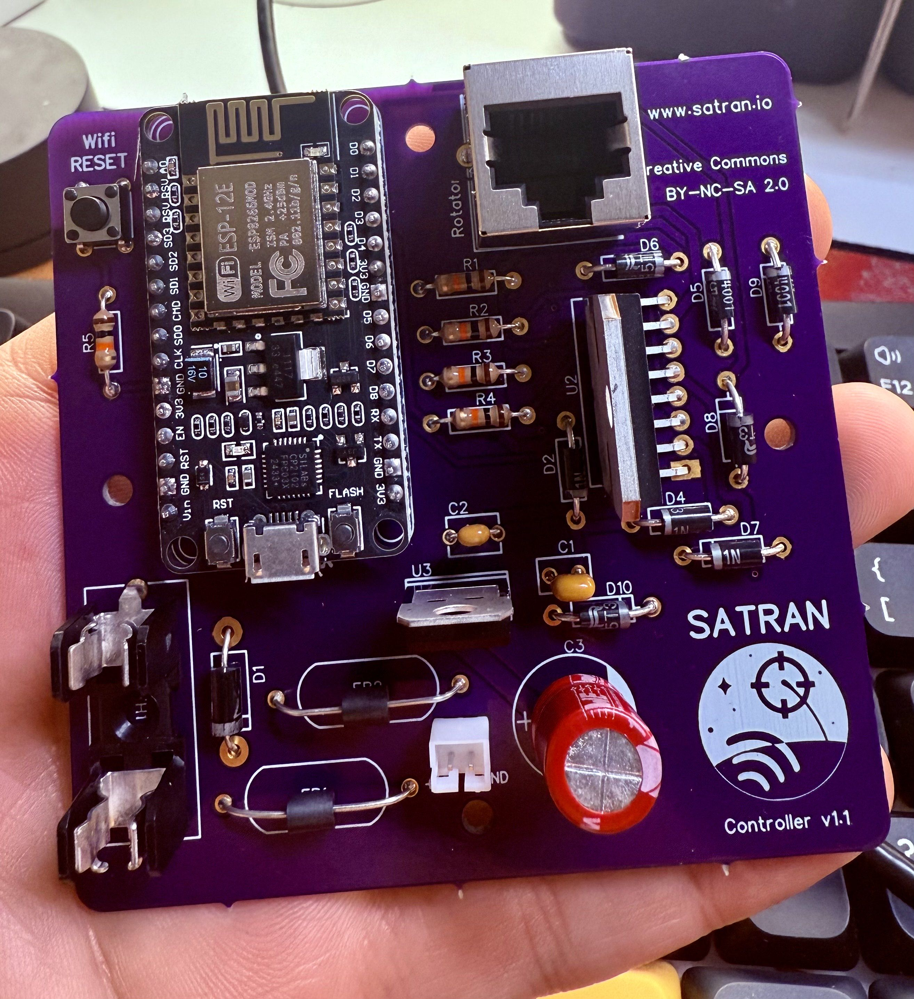
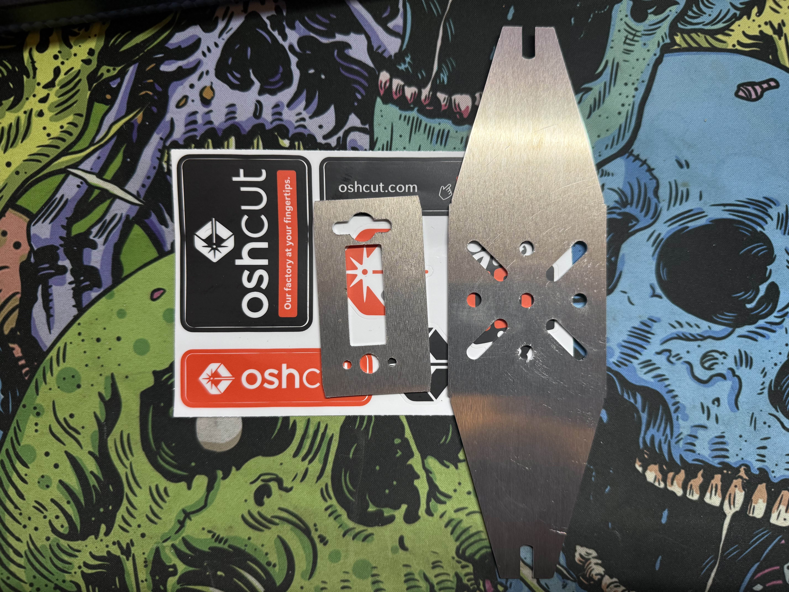
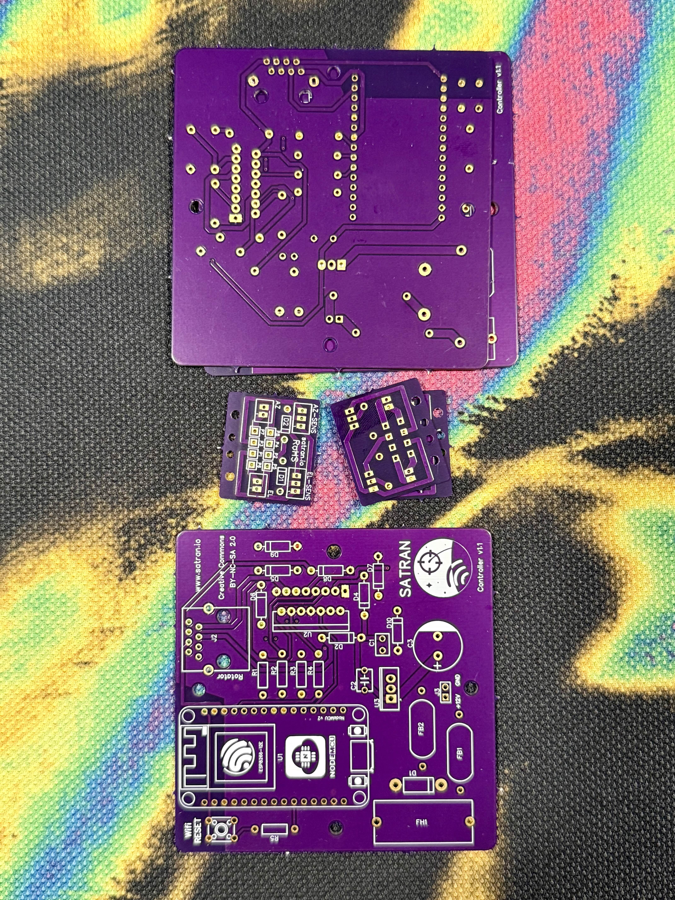
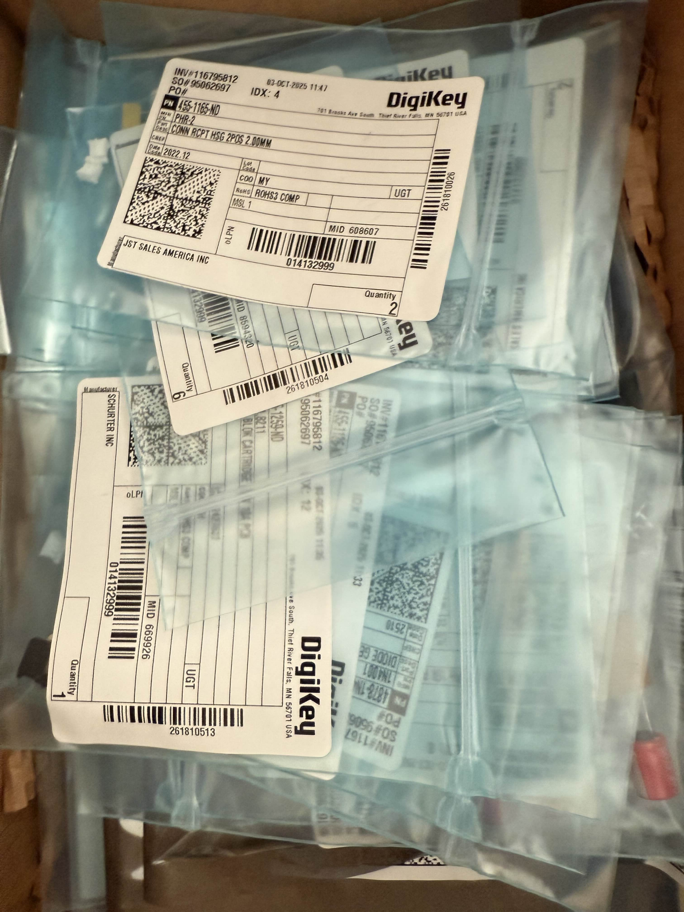
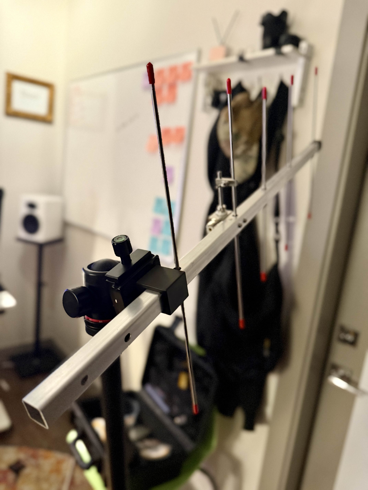

+++
title = "Quick AMSAT Update"
date = "2025-11-01"
+++

All of our components are here and ~~I can start assembly soon(tm)!~~ I've started assembly!

<!--more-->

Update: 11/30 - Here is the completed rotator control board

We've got our mounting bracket from [OSH Cut](https://www.oshcut.com/)

PCBs from [OSH Park](https://oshpark.com/)

And finally the components from [DigiKey](https://www.digikey.com/)

In the mean-time I have also been playing w/ SDR and my YAGI to ~some success

